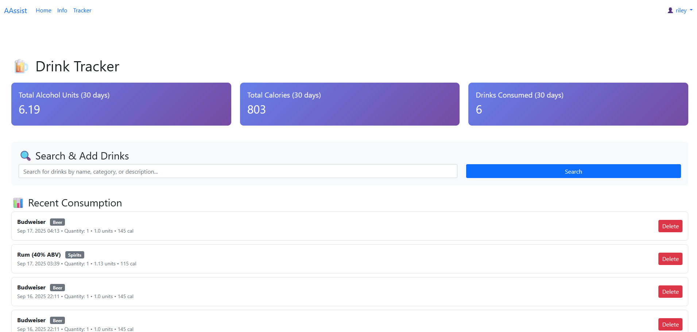

# AAssist - Personal Drink Tracker

A comprehensive Django web application for tracking alcohol consumption, monitoring health metrics, and making informed decisions about drinking habits.

## Table of Contents

- [Screenshots](#screenshots)
- [Features](#features)
- [Usage](#usage)

## Screenshots

### Home Page
- Modern landing page with feature highlights
- Call-to-action sections for new and existing users


### Drink Tracker
- Search interface for finding drinks
- Statistics dashboard showing consumption metrics
- Personal consumption history with detailed information



### Information Hub
- Centralized resoure for alcohol education and safety
- Explains standard drink sizes for beer, wine, and spirits
- Low-risk drinking stategies and harm-reduction strategies


### Authentication
- User registration and login forms
- Secure authentication system
- User profile management


## Features

### **Smart Drink Search**
- Search through hundreds of drinks by name, category, or description
- Real-time search with debounced input
- Comprehensive database of beers, wines, spirits, and cocktails

### **Detailed Analytics**
- Track alcohol units using health-standard calculations
- Monitor calorie intake from alcoholic beverages
- View consumption patterns over the last 30 days
- Personal statistics dashboard

### **Privacy & Security**
- User authentication system
- Personal data isolation
- Secure session management
- CSRF protection

### **User-Friendly Interface**
- Responsive design for all devices
- Intuitive drink addition process
- Real-time updates
- Clean, modern UI with Bootstrap 5

### **Personal Tracking**
- Add personal notes to drink entries
- Track quantity consumed
- View consumption history
- Delete unwanted entries

## Usage

### For Users

1. **Registration/Login**
   - Visit the home page
   - Click "Get Started Free" to register
   - Or "Sign In" if you have an existing account

2. **Tracking Drinks**
   - Navigate to the Tracker page
   - Search for drinks using the search bar
   - Select quantity and add optional notes
   - Click "Add Drink" to record consumption

3. **Viewing Statistics**
   - Check the statistics cards for 30-day totals
   - View your consumption history
   - Monitor alcohol units and calories

## Alcohol Units Calculation

The application uses a health-standard formula for calculating alcohol units:

```python
alcohol_units = (alcohol_content * volume_ml * 0.789) / 14
```

This follows US Standard Drink guidelines where:
- `0.789` = density of pure alcohol (g/ml)
- `14` = grams of pure alcohol in one US standard drink
